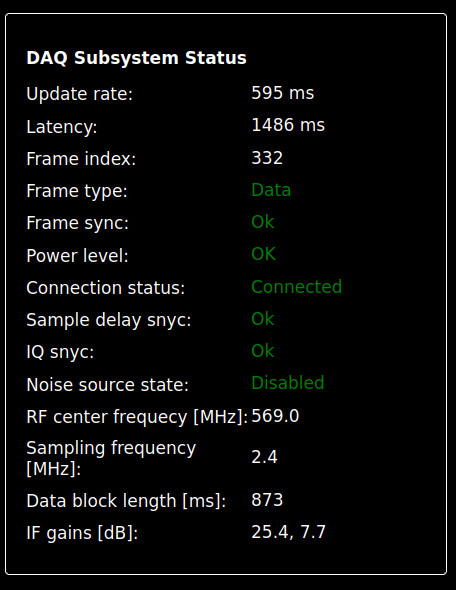
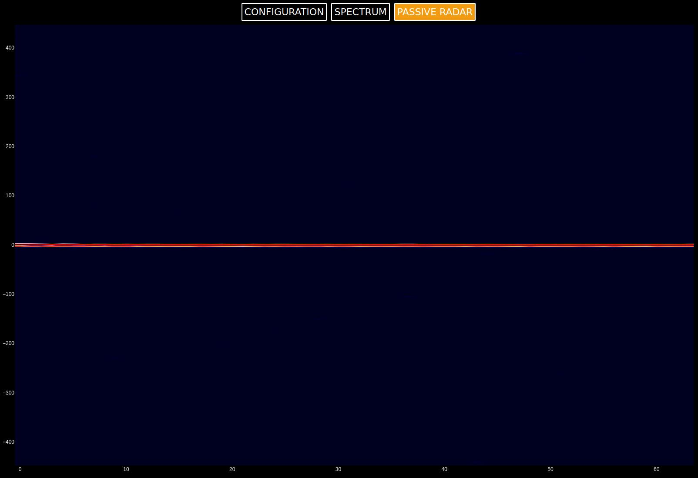

# Kraken SDR Passive Radar

The Kraken devs decided to remove the passive radar code from their repo: https://forum.krakenrf.com/t/where-has-the-passive-radar-code-gone/98.  Forks of it exist [[1]](https://github.com/yuvadm) [[2]](https://github.com/cipher0x/krakensdr_pr) [[3]](https://github.com/CryptoPunk/krakensdr) but are unmaintained and do not provide instructions on directory structure or software configuration. 


This repo includes instructions on setup and removes the need for `conda` in favor of `pip`.

## Quickstart Raspberry Pi 4 Image
 
There is currently no premade Pi image available.  If this changes a link will exist in this section.

## Docker Container

WIP - will update here when tested and ready

## Manual Installation

This is only required if you are not using the premade images, and are setting up the software from a clean system. 

1. Install the prerequisites

``` bash
sudo apt update
sudo apt install libfftw3-3 libfftw3-dev python3-pip
```

2. Install Heimdall DAQ

If not done already, first, follow the instructions at https://github.com/ss32/heimdall_daq_fw to install the Heimdall DAQ Firmware.

3. Clone the `krakensdr_pr`` software

```bash
cd ~/kraknrf
git clone https://github.com/ss32/krakensdr_pr
```

4. Install Python dependencies

``` bash
python3 -m pip install requirements.txt -U
```

## Running

### Directory Structure
Assuming you have followed the instructions including installing Heimdadll DAQ you should have a directory structure in `~/krakenrf` that looks like this

```
.
├── heimdall_daq_fw
│   ├── config_files
│   │   ├── kerberos_default
│   │   ├── kraken_default
│   │   ├── kraken_development
│   │   ├── pr_2ch_2pow16
│   │   ├── pr_2ch_2pow20
│   │   ├── pr_2ch_2pow21
│   │   ├── pr_2ch_2pow22
│   │   └── unit_test_k4
│   ├── Documentation
│   ├── Firmware
│   │   ├── _calibration
│   │   ├── _daq_core
│   │   │   └── __pycache__
│   │   ├── _data_control
│   │   ├── _logs
│   │   ├── __pycache__
│   │   └── _testing
│   │       ├── test_logs
│   │       └── unit_test
│   └── util
└── krakensdr_pr
    ├── _receiver
    │   └── __pycache__
    ├── _signal_processing
    │   └── __pycache__
    ├── _UI
    │   └── _web_interface
    │       ├── assets
    │       └── __pycache__
    └── util
```

### Local operation


Use CH0 to connect your reference antenna, and CH1 for your surveillance antenna.

Start
```bash
./kraken_pr_start.sh
```

Expected output after entering sudo password:

```
$ ./kraken_pr_start.sh 
[sudo] password for krakenrf: 
Config file check bypassed [ WARNING ]
kernel.sched_rt_runtime_us = -1
Desig FIR filter with the following parameters: 
Decimation ratio: 1
Bandwidth: 1.00
Tap size: 1
Window function: hann
FIR filter ready
Transfer funcfion is exported to :  _logs/Decimator_filter_transfer.html
Coefficients are exported to:  _data_control/fir_coeffs.txt
Starting DAQ Subsystem
Output data interface: Shared memory
      )  (     
      (   ) )  
       ) ( (   
     _______)_ 
  .-'---------|
 (  |/\/\/\/\/|
  '-./\/\/\/\/|
    '_________'
     '-------' 
               
Have a coffee watch radar
Starting KrakenSDR Passive Radar

```

Browse to `0.0.0.0:8080` if running locally or `<HOST_IP>:8080` if running on another machine on the same network.

By default the `.ini` that is loaded is configured for passive radar, but others are available in the dropdown menu.  Alternatively, copy the contents of one of the `pr_2ch_xxxx` [config files](https://github.com/ss32/heimdall_daq_fw/tree/main/config_files) to `heimdall_daq_fw/firmware/daq_chain_config.ini`prior to starting.

Please be patient on the first run, at it can take 1-2 minutes for the JIT numba compiler to compile the numba optimized functions, and during this compilation time it may appear that the software has gotten stuck. On subsqeuent runs this loading time will be much faster as it will read from cache.

Click `Start Processing` and wait for all statuses to go green. 



Check the waterfall interface to confirm you have clean signals.  If everything is working as expected you can go to the Passive Radar interface and should see low correlation at all offsets other than 0Hz.




To stop the software run the stop script:

```bash
./kraken_pr_stop.sh
```

### Troubleshooting 

 * Check the contents of `krakensdr_pr/ui.log`
 * Check the contents of the logs in `heimdall_daq_fw/Firmware/_logs/`

If the issue is a problem with this repo please open a bug report.